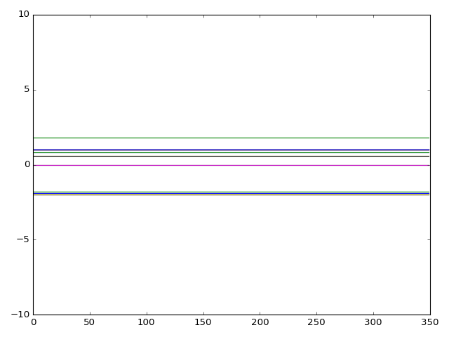

# FeCrAs-Model

This is the Python version of the code I wrote for my PhD project. In this project I construct a 60-band hopping model which can then be used to calculate other quantities, like a dynamic spin structure factor.

