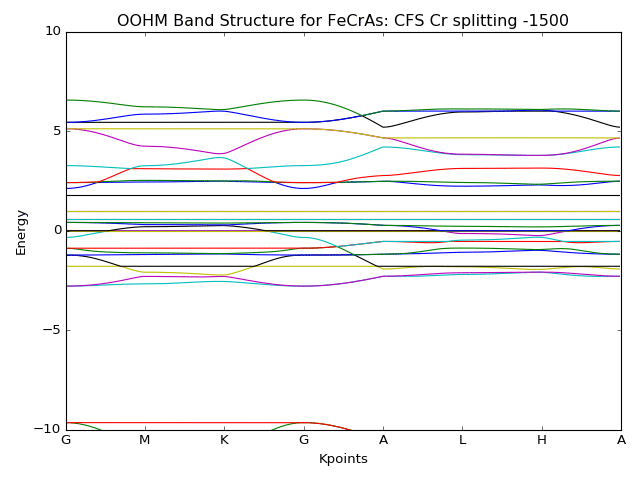
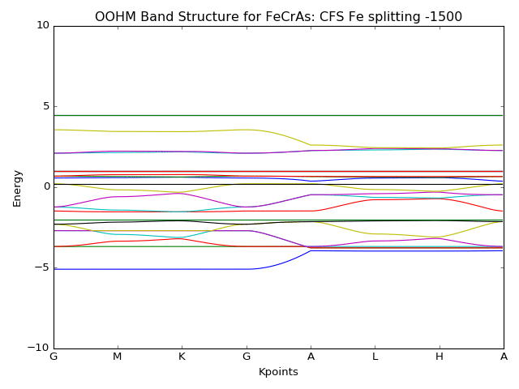

# FeCrAs-Model

This is the Python version of the code I wrote for my PhD project. In this project I construct a 60-band hopping model which can then be used to calculate other quantities, like a dynamic spin structure factor.

This is an animation showing how the band structure changes as the Cr crystal field splitting parameter changes.

This is an animation showing how the band structure changes as the Fe crystal field splitting parameter changes.

None of the parameter animations show the feature of "pinching" together the bottom two bands that we see in the LDA plots. Here are the LDA plots:

The bottom three bands in this LDA plot are very likely Cr bands, because of their similarity to the three bands in our OOHM band structure that are only affected by the Cr crystal field splitting parameter. The Fe crystal field splitting parameter does not move these three bands in out OOHM band structure at all. One possible explanation for the differences between the LDA bands and our OOHM bands is that we have not included sub-dominant hopping processes in our model. Including sub-dominant hopping processes into our model could potentially "pinch" bands together at the special points.

I animated the band structure, changing each of the hopping parameters one at a time. When animating over a given hopping parameter, all other hopping parameters are fixed to be 1. The crystal field splitting parameters for Cr and Fe are set to 1000.

